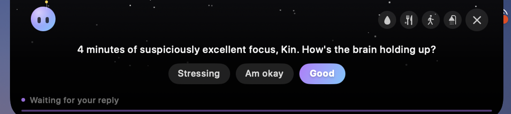
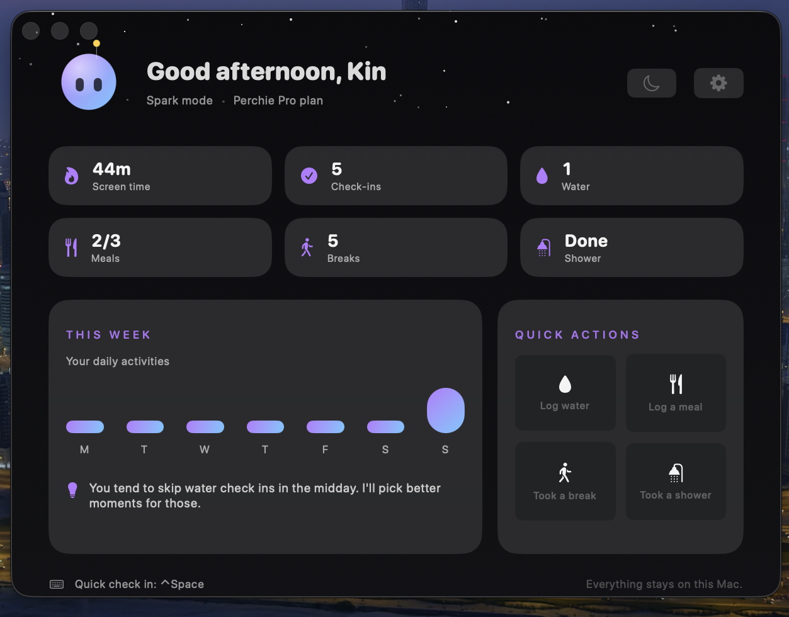
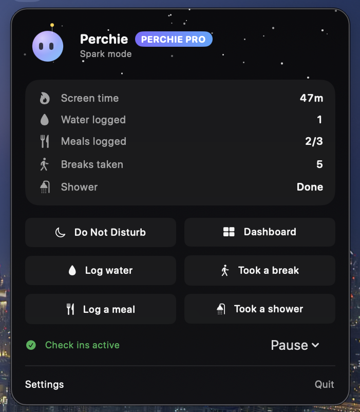
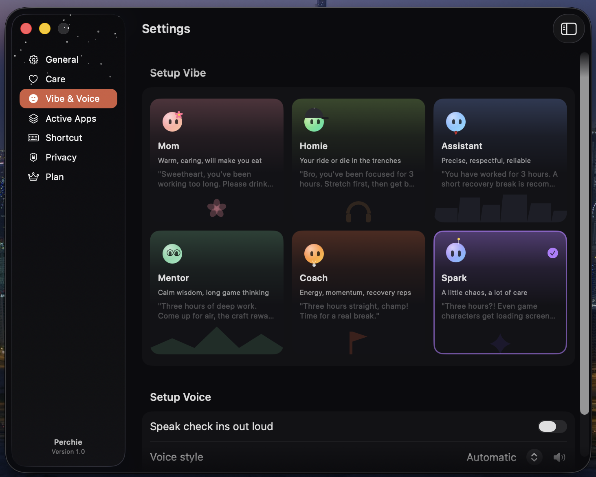
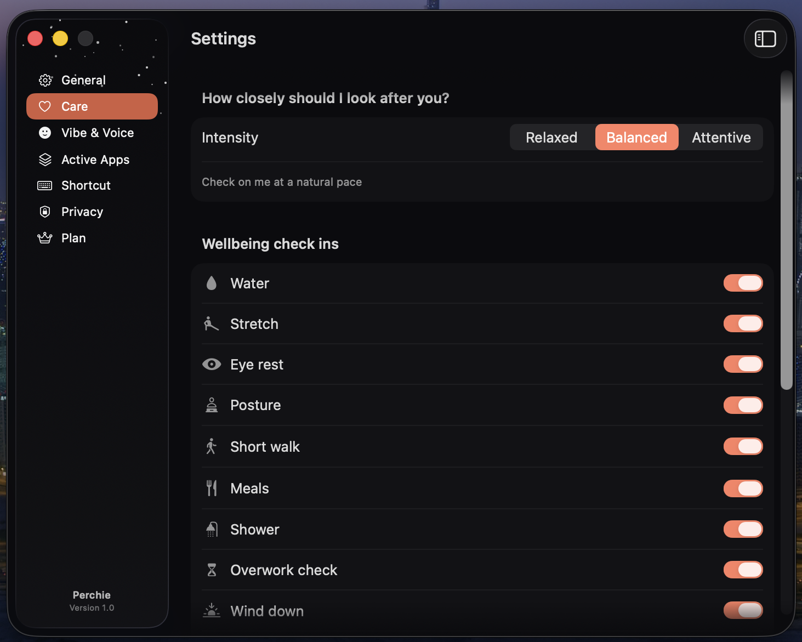
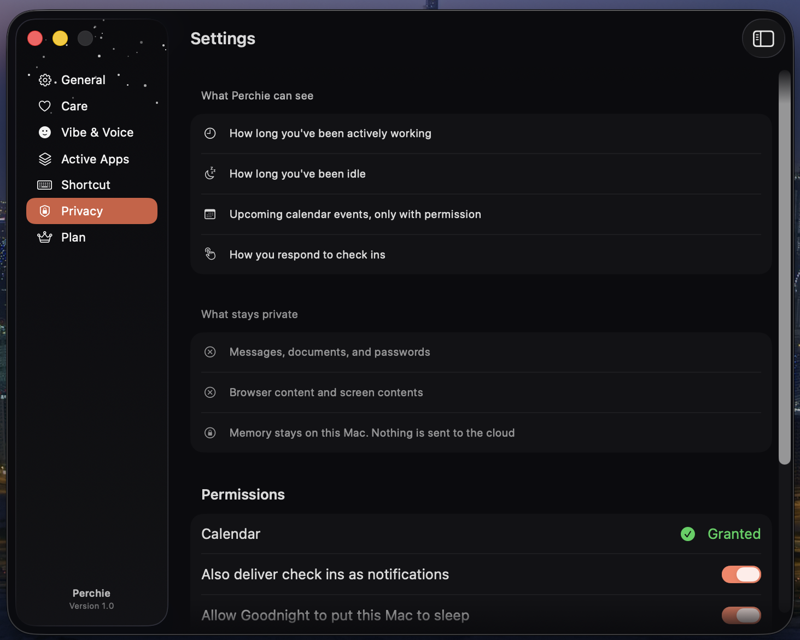
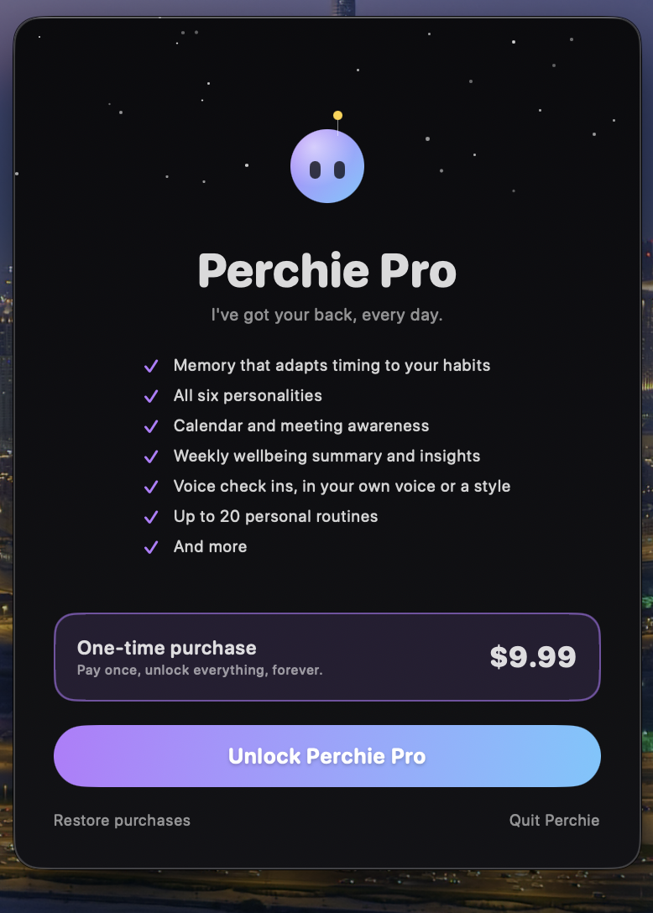

# Perchie

**Your calm companion in the notch.**

Gentle nudges that help you stay focused, take breaks, and end your day without interrupting your flow.

I got sick chasing my dream, so locked in that I forgot to eat, drink water, or move. I didn't want any other builder to end up like me.

Notifications interrupt you, so you ignore them. Perchie just sits where your eyes already go. Habit trackers make logging the whole point. Perchie reaches out first, logging is just a shortcut.

It's not a productivity tracker. It's a companion looking out for you while you're locked in.

*I built this for you, and I hope you take care of yourself now, future founder.*

## Run it yourself

Needs macOS 26 and Xcode 26. Best on a MacBook with a notch.

```bash
git clone https://github.com/kinperezdev/Perch.git
cd Perch
open Perchie.xcodeproj
```

1. In Xcode, select the **Perch** target, open **Signing & Capabilities**, and pick your own **Team**. If Xcode complains about the bundle identifier, change it to anything unique, like `com.yourname.perchie`.
2. Choose the **Perch** scheme and **My Mac**, then press **⌘R**.
3. Perchie lives in your menu bar and your notch, not the Dock. Press **⌃⌥Space** to call it up.

Built from source, Perchie runs in demo mode: the full 3 day trial works, and the Pro unlock is simulated, so no real payment happens.

## Screenshots

**Check in from the notch**



**Dashboard**



**Menu bar**



**Pick a vibe**



**Care settings**



**Privacy first**



**Perchie Pro**


